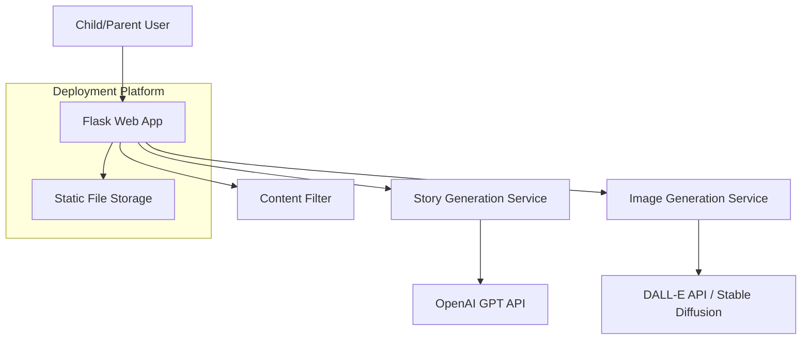

# Design Document: Children's Story Generator

## Overview

A Python Flask web application that generates personalized, age-appropriate stories for children ages 3-10. The system uses AI for story generation and optional image creation, with a child-friendly tablet interface optimized for touch interaction. The application adapts vocabulary complexity and story length based on the child's age group and selected story length preference, with all stories capped at 500 words maximum for optimal tablet reading experience. The application prioritizes simplicity, safety, and rapid deployment.

## Architecture

### High-Level Architecture



### Technology Stack

- **Backend**: Python 3.11+ with Flask
- **Frontend**: HTML5, CSS3, JavaScript (Vanilla JS for simplicity)
- **AI Services**: OpenAI GPT-4 for story generation, DALL-E 3 for images
- **Deployment**: Railway.app (primary choice) or Render.com
- **Storage**: Local file system (sufficient for MVP)
- **Styling**: CSS Grid/Flexbox for responsive tablet design

### Deployment Strategy

**Primary Choice: Railway.app**
- One-click Flask deployment from GitHub
- Built-in environment variable management
- Automatic HTTPS and custom domains
- Simple pricing model ($5/month for hobby projects)
- No complex configuration required

**Alternative: Render.com**
- Free tier available for testing
- Automatic deployments from Git
- Built-in SSL certificates
- Easy environment variable setup

## Components and Interfaces

### 1. Web Application (Flask App)

**Main Application Structure:**
```
app.py                 # Main Flask application
templates/
  ├── index.html      # Story creation form
  ├── story.html      # Generated story display
  └── base.html       # Base template
static/
  ├── css/
  │   └── style.css   # Child-friendly responsive styles
  ├── js/
  │   └── app.js      # Form handling and TTS
  └── images/         # UI icons and assets
services/
  ├── story_generator.py    # Story generation logic
  ├── image_generator.py    # Image generation logic
  └── content_filter.py     # Content safety validation
```

**Key Routes:**
- `GET /` - Story creation form with age group and length selection
- `POST /generate` - Generate story with age-appropriate vocabulary and length
- `GET /story/<story_id>` - Display generated story
- `POST /tts` - Text-to-speech endpoint

### 2. Story Generation Service

**Interface:**
```python
class StoryGenerator:
    def generate_story(self, characters: List[Character], 
                      topic: str, keywords: List[str],
                      age_group: str, story_length: str) -> Story:
        """Generate age-appropriate story with moral lesson"""
        
class Character:
    name: str
    pronouns: str  # "he/him", "she/her", "they/them"
    
class Story:
    title: str
    content: str
    moral: str
    word_count: int
    age_group: str
    story_length: str
```

**Story Generation Process:**
1. Validate and sanitize all inputs including age group and story length
2. Determine target word count based on age group and length selection
3. Select vocabulary complexity level based on age group
4. Create age-appropriate prompt with characters, topic, and complexity requirements
5. Include moral lesson requirement in prompt
6. Generate story using OpenAI GPT-4 with length and vocabulary constraints
7. Validate output for appropriateness, length, and vocabulary level
8. Return structured story object

### 3. Image Generation Service

**Interface:**
```python
class ImageGenerator:
    def generate_illustration(self, story: Story, 
                            topic: str) -> Optional[str]:
        """Generate child-friendly illustration"""
```

**Image Generation Process:**
1. Extract key visual elements from story
2. Create child-safe image prompt
3. Generate image using DALL-E 3
4. Validate image content appropriateness
5. Return image URL or None if failed

### 4. Content Filter

**Interface:**
```python
class ContentFilter:
    def validate_keywords(self, keywords: List[str]) -> bool:
        """Ensure keywords are child-appropriate"""
        
    def validate_story_content(self, content: str, age_group: str) -> bool:
        """Verify story meets safety and vocabulary standards for age group"""
        
    def get_vocabulary_level(self, age_group: str) -> str:
        """Return vocabulary complexity level for age group"""
```

**Filtering Rules:**
- **Ages 3-4**: Simple vocabulary (1-3 syllables), basic sentence structures
- **Ages 5-6**: Elementary vocabulary (some 4-syllable words), compound sentences  
- **Ages 7-8**: Intermediate vocabulary, varied sentence structures
- **Ages 9-10**: Advanced vocabulary while maintaining age-appropriate themes
- No violent, scary, or inappropriate themes for all age groups
- Positive, uplifting content only

## Data Models

### Character Model
```python
@dataclass
class Character:
    name: str
    pronouns: str
    
    def validate(self) -> bool:
        """Validate name contains only letters and spaces"""
        return bool(re.match(r'^[A-Za-z\s]+$', self.name))
```

### Story Request Model
```python
@dataclass
class StoryRequest:
    characters: List[Character]
    topic: str  # "space", "community", "dragons", "fairies"
    keywords: List[str]  # 3 or 5 keywords
    age_group: str  # "3-4", "5-6", "7-8", "9-10"
    story_length: str  # "short", "medium", "long"
    include_image: bool = False
    
    def validate(self) -> List[str]:
        """Return list of validation errors"""
        
    def get_target_word_count_range(self) -> tuple[int, int]:
        """Return (min_words, max_words) based on age_group and story_length"""
```

### Generated Story Model
```python
@dataclass
class GeneratedStory:
    id: str
    title: str
    content: str
    moral: str
    characters: List[Character]
    topic: str
    age_group: str
    story_length: str
    image_url: Optional[str]
    created_at: datetime
    word_count: int
    target_word_range: tuple[int, int]
```

## User Interface Design

### Tablet-Optimized Layout

**Design Principles:**
- Minimum 44px touch targets for all interactive elements
- Large, colorful buttons with clear visual feedback
- Simple, picture-based navigation
- Immediate visual confirmation for all actions
- Responsive design optimized for 768px+ screens

**Form Layout:**
```
┌─────────────────────────────────────┐
│  🌟 Create Your Story! 🌟          │
├─────────────────────────────────────┤
│  Child's Age: [3-4▼] [5-6] [7-8] [9-10] │
│                                     │
│  Story Length: [Short▼] [Medium] [Long] │
│                                     │
│  How many characters? [1▼] [2] [3]  │
│                                     │
│  Character 1:                       │
│  Name: [____________]               │
│  Pronouns: [he/him▼] [she/her] [...] │
│                                     │
│  Pick a topic:                      │
│  [🚀 Space] [🏘️ Community]          │
│  [🐉 Dragons] [🧚 Fairies]          │
│                                     │
│  Keywords (pick 3 or 5):           │
│  [___] [___] [___] [___] [___]      │
│                                     │
│  [✨ Add Picture?] ☐               │
│                                     │
│  [🎨 CREATE STORY! 🎨]             │
└─────────────────────────────────────┘
```

### Story Display Layout
```
┌─────────────────────────────────────┐
│  📖 Your Amazing Story! 📖          │
├─────────────────────────────────────┤
│  [🔊 Read Aloud] [📄 Print] [💾 Save] │
│                                     │
│  ┌─────────────────────────────────┐ │
│  │     [Generated Image]           │ │
│  └─────────────────────────────────┘ │
│                                     │
│  Story Title                        │
│  ═══════════════                    │
│                                     │
│  Story content with large,          │
│  child-friendly font and            │
│  appropriate line spacing...        │
│                                     │
│  [🎭 Create Another Story!]         │
└─────────────────────────────────────┘
```

## Text-to-Speech Implementation

**Browser-Based TTS:**
```javascript
class StoryReader {
    constructor() {
        this.synth = window.speechSynthesis;
        this.voices = [];
        this.currentUtterance = null;
    }
    
    loadVoices() {
        // Load available voices, prefer child-friendly options
    }
    
    readStory(text, voiceIndex = 0) {
        // Read story with appropriate pacing for children
    }
    
    pause() { /* Pause playback */ }
    resume() { /* Resume playback */ }
    stop() { /* Stop playback */ }
}
```

**Features:**
- Voice selection (2-3 options)
- Playback controls (play, pause, stop)
- Child-appropriate pacing and intonation
- Fallback message if TTS unavailable

## Error Handling

### Input Validation Errors
- Clear, child-friendly error messages
- Visual indicators for invalid fields
- Prevent form submission until all errors resolved

### API Failures
- Graceful degradation for image generation failures
- Retry logic for story generation
- User-friendly error messages
- Fallback to text-only stories

### Content Safety
- Automatic content filtering
- Manual review flags for edge cases
- Safe defaults for all generated content

## Testing Strategy

### Unit Tests
- Input validation functions
- Content filtering logic
- Story generation prompts
- Character model validation

### Integration Tests
- End-to-end story generation flow
- Image generation with fallbacks
- Text-to-speech functionality
- Form submission and validation

### User Experience Tests
- Tablet touch interaction testing
- Child usability testing (if possible)
- Cross-browser compatibility
- Responsive design validation

## Deployment Configuration

### Railway.app Setup
```yaml
# railway.toml
[build]
builder = "NIXPACKS"

[deploy]
healthcheckPath = "/health"
restartPolicyType = "ON_FAILURE"

[env]
OPENAI_API_KEY = "${{OPENAI_API_KEY}}"
FLASK_ENV = "production"
```

### Environment Variables
```
OPENAI_API_KEY=sk-...
FLASK_SECRET_KEY=random-secret-key
FLASK_ENV=production
MAX_STORY_LENGTH=400
DEFAULT_VOICE_SPEED=0.8
```

### Requirements.txt
```
Flask==3.0.0
openai==1.3.0
python-dotenv==1.0.0
gunicorn==21.2.0
requests==2.31.0
```

## Security Considerations

### Input Sanitization
- Validate all user inputs
- Sanitize character names and keywords
- Prevent injection attacks

### API Key Management
- Store API keys as environment variables
- Never expose keys in client-side code
- Implement rate limiting for API calls

### Content Safety
- Multi-layer content filtering
- Age-appropriate vocabulary validation
- Positive theme enforcement

## Performance Optimization

### Caching Strategy
- Cache generated stories for repeat access
- Store common story templates
- Optimize image loading and display

### API Efficiency
- Batch API requests where possible
- Implement request timeouts
- Use efficient prompt engineering

### Frontend Optimization
- Minimize JavaScript for faster loading
- Optimize images for web display
- Use CSS for animations instead of JavaScript

## Monitoring and Analytics

### Basic Metrics
- Story generation success rate
- Image generation success rate
- User interaction patterns
- Error rates and types

### Simple Logging
```python
import logging

logging.basicConfig(
    level=logging.INFO,
    format='%(asctime)s - %(levelname)s - %(message)s'
)

# Log story generations, errors, and user interactions
```

## Correctness Properties

*A property is a characteristic or behavior that should hold true across all valid executions of a system—essentially, a formal statement about what the system should do. Properties serve as the bridge between human-readable specifications and machine-verifiable correctness guarantees.*

### Property 1: Age Group and Story Length Input Validation
*For any* age group selection (3-4, 5-6, 7-8, 9-10) and story length selection (short, medium, long), the system should accept valid combinations and display appropriate input fields
**Validates: Requirements 1.1, 1.2**

### Property 2: Keyword Count Validation
*For any* keyword input, the system should accept it if and only if it contains exactly 3 or 5 keywords
**Validates: Requirements 1.7**

### Property 3: Input Validation Error Handling
*For any* invalid input (empty names, invalid characters, wrong keyword count, missing age/length selection), the system should display clear error messages and prevent story generation
**Validates: Requirements 1.8**

### Property 4: Character Name Validation
*For any* character name input, the system should accept it if and only if it contains only letters and spaces
**Validates: Requirements 1.9**

### Property 5: Age-Appropriate Vocabulary Generation
*For any* selected age group, the generated story should use vocabulary complexity appropriate to that age group (simple for 3-4, elementary for 5-6, intermediate for 7-8, advanced for 9-10)
**Validates: Requirements 2.1, 2.2, 2.3, 2.4**

### Property 6: Keyword Content Filtering
*For any* set of user keywords, inappropriate keywords should be filtered out before story generation
**Validates: Requirements 2.6**

### Property 7: Story Moral Inclusion
*For any* generated story, it should contain exactly one identifiable moral or lesson
**Validates: Requirements 3.1**

### Property 8: Story Structure Validation
*For any* generated story, it should have identifiable beginning, middle, and end sections
**Validates: Requirements 3.3**

### Property 9: Character Name Inclusion
*For any* set of input characters, all character names should appear prominently in the generated story
**Validates: Requirements 3.4**

### Property 10: Pronoun Consistency
*For any* character with selected pronouns, those pronouns should be used consistently throughout the generated story
**Validates: Requirements 3.5**

### Property 11: Story Length Validation by Age and Length Selection
*For any* combination of age group and story length selection, the generated story word count should fall within the specified range for that combination
**Validates: Requirements 3.6-3.17**

### Property 12: Topic-Appropriate Content Generation
*For any* selected topic (space, community, dragons, fairies), the generated story should contain relevant keywords and themes appropriate to that topic
**Validates: Requirements 4.1, 4.2, 4.3, 4.4**

### Property 13: Image Generation Error Handling
*For any* story generation request, if image generation fails, the story should still be displayed with an appropriate error message
**Validates: Requirements 5.4**

### Property 14: API Call Efficiency
*For any* story generation request, the system should minimize the number of external API calls required
**Validates: Requirements 6.5**

### Property 15: Touch Target Size Compliance
*For any* interactive UI element, it should meet the minimum 44px touch target requirement
**Validates: Requirements 7.2**

### Property 16: UI Responsiveness
*For any* user interaction, the system should provide visual feedback within a reasonable time frame
**Validates: Requirements 7.5**

### Property 17: Responsive Design Validation
*For any* screen size 768px and larger, the layout should display correctly and remain functional
**Validates: Requirements 7.7**

### Property 18: Image Display Conditional Logic
*For any* story with a generated image, the image should be displayed alongside the story text
**Validates: Requirements 8.5**

### Property 19: Text-to-Speech Functionality
*For any* story displayed with TTS available, activating read aloud should trigger speech synthesis for the complete story text
**Validates: Requirements 9.2**

### Property 20: TTS Unavailability Handling
*For any* browser environment where text-to-speech is unavailable, an appropriate explanatory message should be displayed
**Validates: Requirements 9.6**

This design provides a solid foundation for rapid development and deployment while maintaining focus on child safety, usability, and educational value.