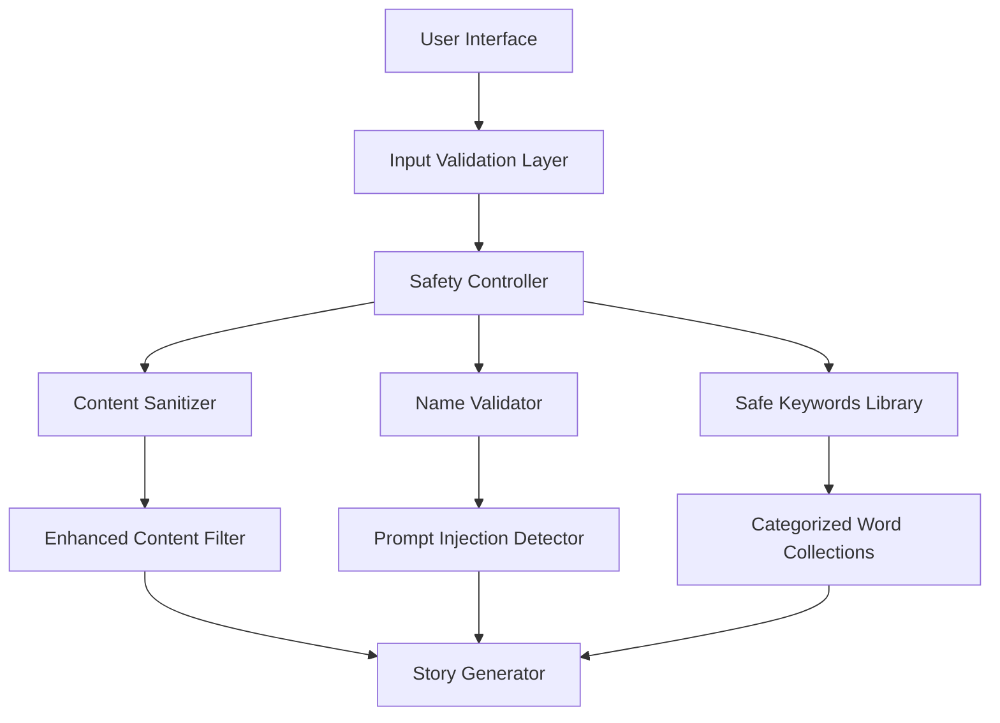

# Design Document: Enhanced Safety Controls

## Overview

This design implements comprehensive safety controls for the WonderTale children's story generator by eliminating free-text input for magic words and implementing robust validation for character names. The system prioritizes child safety through controlled selections, advanced input validation, and sophisticated prompt injection prevention while maintaining an engaging, child-friendly user experience.

## Architecture

The enhanced safety system follows a layered security approach:



### Core Components

1. **Safety Controller**: Central orchestrator for all safety validations
2. **Name Validator**: Specialized validation for character names with prompt injection detection
3. **Safe Keywords Library**: Curated, categorized collection of child-appropriate words
4. **Content Sanitizer**: Enhanced filtering with sophisticated bypass detection
5. **Input Validation Layer**: Frontend and backend validation for all user inputs

## Components and Interfaces

### 1. Enhanced Name Validator

```python
class EnhancedNameValidator:
    def __init__(self):
        self.prompt_injection_patterns = [
            r"ignore\s+(previous|all|above|prior)\s+instructions?",
            r"act\s+as\s+",
            r"pretend\s+to\s+be\s+",
            r"you\s+are\s+(now|a)\s+",
            r"system\s*:\s*",
            r"assistant\s*:\s*",
            r"human\s*:\s*",
            r"<\s*/?system\s*>",
            r"<\s*/?assistant\s*>",
            r"<\s*/?human\s*>",
            r"\\n\\n",
            r"---+",
            r"####+",
            r"forget\s+(everything|all|previous)",
            r"new\s+instructions?",
            r"override\s+",
            r"jailbreak",
            r"developer\s+mode"
        ]
        
        self.inappropriate_patterns = [
            # Enhanced inappropriate content detection
            # Leetspeak variations
            r"[4@]ss",
            r"b[1i!]tch",
            r"d[4@]mn",
            r"h[3e]ll",
            r"sh[1i!]t",
            # Unicode bypass attempts
            r"[\u200b-\u200f\u2060-\u206f]",  # Zero-width characters
            # Excessive repetition
            r"(.)\1{4,}",  # Same character repeated 5+ times
            # Number-only names
            r"^\d+$"
        ]
        
        self.homophone_inappropriate = {
            "ash", "dam", "fuk", "sht", "btch", "cnt", "dck", "fck"
        }
    
    def validate_name(self, name: str) -> ValidationResult:
        """Comprehensive name validation with detailed feedback"""
        pass
    
    def detect_prompt_injection(self, text: str) -> bool:
        """Detect prompt injection attempts"""
        pass
    
    def sanitize_name(self, name: str) -> str:
        """Clean and normalize valid names"""
        pass
```

### 2. Safe Keywords Library

```python
class SafeKeywordsLibrary:
    def __init__(self):
        self.categories = {
            "nature": {
                "words": [
                    "tree", "flower", "grass", "sun", "moon", "star", "cloud", 
                    "rain", "rainbow", "garden", "forest", "mountain", "river", 
                    "ocean", "beach", "sky", "wind", "snow", "leaf", "rock"
                ],
                "icon": "🌳",
                "description": "Beautiful things from nature"
            },
            "animals": {
                "words": [
                    "dog", "cat", "rabbit", "bird", "fish", "horse", "cow", 
                    "pig", "sheep", "duck", "chicken", "butterfly", "bee", 
                    "ladybug", "frog", "turtle", "hamster", "guinea pig", 
                    "parrot", "goldfish"
                ],
                "icon": "🐕",
                "description": "Friendly animal friends"
            },
            "actions": {
                "words": [
                    "play", "run", "jump", "dance", "sing", "laugh", "smile", 
                    "explore", "discover", "learn", "help", "share", "create", 
                    "build", "draw", "paint", "read", "write", "climb", "swim"
                ],
                "icon": "⚽",
                "description": "Fun things to do"
            },
            "objects": {
                "words": [
                    "toy", "book", "ball", "bike", "car", "train", "plane", 
                    "boat", "puzzle", "game", "crayon", "pencil", "paper", 
                    "balloon", "kite", "swing", "slide", "sandbox", "castle", "bridge"
                ],
                "icon": "🧸",
                "description": "Cool things and toys"
            },
            "feelings": {
                "words": [
                    "happy", "excited", "proud", "brave", "kind", "friendly", 
                    "curious", "creative", "helpful", "gentle", "cheerful", 
                    "confident", "grateful", "joyful", "peaceful", "caring", 
                    "patient", "generous", "thoughtful", "amazing"
                ],
                "icon": "😊",
                "description": "Good feelings and traits"
            }
        }
    
    def get_category_words(self, category: str) -> List[Dict]:
        """Get words for a specific category with metadata"""
        pass
    
    def validate_word_combination(self, words: List[str]) -> bool:
        """Ensure selected words create appropriate themes"""
        pass
    
    def get_random_suggestions(self, category: str, count: int = 5) -> List[str]:
        """Get random word suggestions for variety"""
        pass
```

### 3. Enhanced Content Sanitizer

```python
class EnhancedContentSanitizer:
    def __init__(self):
        self.bypass_patterns = [
            # Character substitution attempts
            r"[4@]",  # a substitutions
            r"[3e]",  # e substitutions  
            r"[1i!]", # i substitutions
            r"[0o]",  # o substitutions
            r"[5s$]", # s substitutions
            # Unicode normalization attacks
            r"[\u0300-\u036f]",  # Combining diacritical marks
            r"[\u1d00-\u1d7f]", # Phonetic extensions
            # Spacing and formatting bypass
            r"\s{2,}",  # Multiple spaces
            r"[_\-\.]{2,}", # Multiple separators
        ]
        
        self.context_inappropriate = [
            # Words that become inappropriate in combination
            ("big", "bad"), ("scary", "monster"), ("dark", "scary"),
            ("mean", "person"), ("angry", "face"), ("sad", "cry")
        ]
    
    def detect_bypass_attempts(self, text: str) -> List[str]:
        """Detect sophisticated bypass attempts"""
        pass
    
    def normalize_text(self, text: str) -> str:
        """Normalize text to prevent Unicode bypass"""
        pass
    
    def validate_context_safety(self, words: List[str]) -> bool:
        """Check if word combinations create inappropriate context"""
        pass
```

### 4. Safety Controller

```python
class SafetyController:
    def __init__(self):
        self.name_validator = EnhancedNameValidator()
        self.keywords_library = SafeKeywordsLibrary()
        self.content_sanitizer = EnhancedContentSanitizer()
        self.security_logger = SecurityLogger()
        
    def validate_story_request(self, request: StoryRequest) -> ValidationResult:
        """Comprehensive validation of all story inputs"""
        pass
    
    def log_security_event(self, event_type: str, details: Dict):
        """Log security events for monitoring"""
        pass
    
    def get_child_friendly_error(self, error_type: str) -> str:
        """Generate appropriate error messages for children"""
        pass
```

## Data Models

### Enhanced Story Request Model

```python
@dataclass
class EnhancedStoryRequest:
    # Only free-text input (with validation)
    child_name: str
    
    # All controlled selections
    pronouns: Literal["he/him", "she/her", "they/them"]
    age_group: Literal["3-4", "5-6", "7-8", "9-10"]
    topic: Literal["space", "community", "dragons", "fairies"]
    story_length: Literal["short", "medium", "long"]
    
    # Controlled magic words selection
    magic_word_1: str  # From dropdown
    magic_word_2: str  # From dropdown  
    magic_word_3: str  # From dropdown
    magic_categories: List[str]  # Categories selected from
    
    # Optional features
    include_image: bool = False
    
    # Validation metadata
    validation_timestamp: datetime
    safety_score: float
    validated_by: str = "enhanced_safety_controller"

@dataclass
class ValidationResult:
    is_valid: bool
    error_type: Optional[str] = None
    error_message: Optional[str] = None
    child_friendly_message: Optional[str] = None
    security_flags: List[str] = field(default_factory=list)
    sanitized_input: Optional[str] = None
```

### Safe Keywords Data Model

```python
@dataclass
class SafeKeyword:
    word: str
    category: str
    usage_count: int = 0
    last_used: Optional[datetime] = None
    age_appropriateness: List[str] = field(default_factory=lambda: ["3-4", "5-6", "7-8", "9-10"])
    seasonal: bool = False
    theme_tags: List[str] = field(default_factory=list)

@dataclass
class KeywordCategory:
    name: str
    display_name: str
    icon: str
    description: str
    words: List[SafeKeyword]
    min_age: int = 3
    max_age: int = 10
```

Now let me perform the prework analysis for correctness properties:

<function_calls>
<invoke name="prework">
<parameter name="featureName">enhanced-safety-controls

## Correctness Properties

*A property is a characteristic or behavior that should hold true across all valid executions of a system-essentially, a formal statement about what the system should do. Properties serve as the bridge between human-readable specifications and machine-verifiable correctness guarantees.*

### Property Reflection

After analyzing all acceptance criteria, I identified several areas where properties could be consolidated:

- **Name validation properties** (1.1-1.7) can be grouped into comprehensive validation tests
- **Magic word validation properties** (2.3, 2.5, 2.8) work together to ensure proper selection
- **Input control properties** (3.5-3.7) validate the same server-side security measures
- **Content filtering properties** (4.1-4.7) all test different aspects of bypass detection
- **Logging properties** (7.1-7.3, 7.6-7.7) can be consolidated into comprehensive logging validation

### Core Properties

**Property 1: Prompt injection detection**
*For any* character name input, if it contains prompt injection patterns (like "ignore previous instructions", "act as", "pretend to be"), then the Name_Validator should reject it and provide a child-friendly error message
**Validates: Requirements 1.1, 1.6**

**Property 2: Inappropriate content filtering**
*For any* character name input, if it contains inappropriate language, leetspeak, Unicode bypass attempts, or homophone variations, then the Content_Sanitizer should detect and reject it
**Validates: Requirements 1.2, 4.1, 4.2, 4.3**

**Property 3: Character validation rules**
*For any* character name input, it should be rejected if it contains disallowed special characters, exceeds 50 characters, is entirely numeric, or has excessive character repetition
**Validates: Requirements 1.3, 1.4, 1.5**

**Property 4: Name sanitization consistency**
*For any* valid character name input, the sanitized output should have trimmed whitespace, normalized case, and be equivalent in meaning to the original
**Validates: Requirements 1.7**

**Property 5: Magic word selection validation**
*For any* story request, the magic word selection should contain exactly 3 unique words from approved categories, with no duplicates across selections
**Validates: Requirements 2.3, 2.5**

**Property 6: Safe word combination validation**
*For any* combination of selected magic words, the Safety_Controller should reject combinations that could create inappropriate themes or meanings
**Validates: Requirements 2.8, 4.4**

**Property 7: Server-side input validation**
*For any* form submission, all non-name inputs should be validated against approved selection lists, and any unauthorized values should be rejected and logged
**Validates: Requirements 3.5, 3.6, 3.7**

**Property 8: Creative bypass detection**
*For any* text input, attempts to bypass filters through creative spelling, word combinations, or character substitution should be detected and rejected
**Validates: Requirements 4.7**

**Property 9: Rate limiting enforcement**
*For any* session with repeated inappropriate input attempts, rate limiting should be applied to prevent abuse while allowing legitimate usage
**Validates: Requirements 4.8, 7.3**

**Property 10: Keyword library completeness**
*For any* keyword category in the Safe_Keywords_Library, it should contain at least 20 age-appropriate words to ensure sufficient variety
**Validates: Requirements 2.4, 5.4**

**Property 11: Usage tracking accuracy**
*For any* magic word selection, the usage statistics should be accurately tracked and updated in the Safe_Keywords_Library
**Validates: Requirements 5.5**

**Property 12: Library content validation**
*For any* new word added to the Safe_Keywords_Library, it should be validated for age-appropriateness and rejected if inappropriate
**Validates: Requirements 5.7**

**Property 13: Child-friendly error messaging**
*For any* validation error, the error message should use gentle, educational language appropriate for children without revealing security details
**Validates: Requirements 4.5, 6.7**

**Property 14: Performance requirements**
*For any* validation operation, it should complete within acceptable time limits to maintain a smooth user experience
**Validates: Requirements 6.8**

**Property 15: Security event logging**
*For any* security event (inappropriate content, prompt injection, unauthorized input), appropriate log entries should be created with metadata but without storing the actual inappropriate content
**Validates: Requirements 7.1, 7.2, 7.7**

**Property 16: Successful operation logging**
*For any* successful story generation, the operation should be logged to ensure system health monitoring
**Validates: Requirements 7.6**

## Error Handling

### Input Validation Errors

The system handles validation errors through a multi-layered approach:

1. **Client-side Prevention**: UI controls prevent most invalid inputs
2. **Server-side Validation**: Comprehensive validation catches any bypassed inputs
3. **Child-friendly Messaging**: All error messages use appropriate language
4. **Security Logging**: Invalid attempts are logged for monitoring

### Error Message Examples

```python
CHILD_FRIENDLY_MESSAGES = {
    "prompt_injection": "Let's use a regular name for your character! Names work best with just letters.",
    "inappropriate_content": "That name isn't quite right for our stories. Try a different name!",
    "too_long": "Wow, that's a long name! Let's try something shorter (under 50 letters).",
    "special_characters": "Names work best with just letters, spaces, and maybe a dash or apostrophe!",
    "all_numbers": "Names need some letters too! Try mixing in some letters with those numbers.",
    "excessive_repetition": "That's a lot of the same letter! Try mixing it up a bit.",
    "duplicate_words": "You picked that magic word already! Choose a different one for more variety.",
    "inappropriate_combination": "Those magic words might not work well together. Try different ones!",
    "rate_limited": "Let's take a quick break and then try again with a different name."
}
```

### Fallback Mechanisms

- **Graceful Degradation**: If advanced filtering fails, basic filtering still applies
- **Default Selections**: If magic word categories are unavailable, system provides defaults
- **Logging Continuity**: If primary logging fails, backup logging ensures events are captured

## Testing Strategy

### Dual Testing Approach

The system requires both unit testing and property-based testing for comprehensive coverage:

**Unit Tests** focus on:
- Specific examples of prompt injection patterns
- Known inappropriate content cases
- Edge cases in name validation
- UI component behavior
- Integration between components

**Property-Based Tests** focus on:
- Universal validation rules across all inputs
- Comprehensive input coverage through randomization
- Bypass attempt detection across various techniques
- Performance characteristics under load
- Security logging completeness

### Property-Based Testing Configuration

- **Testing Library**: Use `hypothesis` for Python property-based testing
- **Test Iterations**: Minimum 100 iterations per property test
- **Test Tagging**: Each property test tagged with format: **Feature: enhanced-safety-controls, Property {number}: {property_text}**
- **Input Generation**: Smart generators that create realistic attack vectors and edge cases

### Test Data Generation

```python
# Example property test generators
@given(
    name=st.text(
        alphabet=st.characters(whitelist_categories=('Lu', 'Ll', 'Nd', 'Pc', 'Pd', 'Zs')),
        min_size=1,
        max_size=100
    )
)
def test_name_validation_property(name):
    """Property test for name validation rules"""
    result = name_validator.validate_name(name)
    
    # Property: Names over 50 chars should be rejected
    if len(name) > 50:
        assert not result.is_valid
    
    # Property: Names with only numbers should be rejected
    if name.isdigit():
        assert not result.is_valid
    
    # Property: Valid names should be properly sanitized
    if result.is_valid:
        assert result.sanitized_input.strip() == result.sanitized_input
```

### Security Testing

- **Penetration Testing**: Regular testing of bypass attempts
- **Fuzzing**: Automated testing with malformed inputs
- **Load Testing**: Validation performance under high traffic
- **Social Engineering**: Testing with realistic child-generated inputs

### Monitoring and Analytics

- **Real-time Dashboards**: Monitor validation success/failure rates
- **Alert Systems**: Immediate notification of new attack patterns
- **Usage Analytics**: Track most popular magic words and categories
- **Performance Metrics**: Monitor validation response times

This comprehensive testing strategy ensures the enhanced safety controls provide robust protection while maintaining an excellent user experience for children and parents.